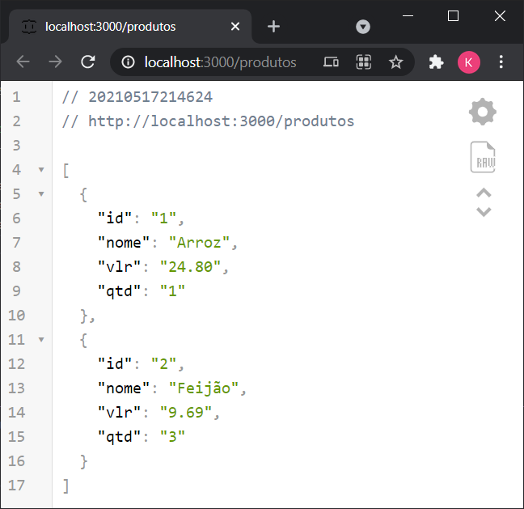

# CRUD JSON-Server

Exemplo de uma aplicação web Front-end utilizando o JSON-Server como backend.

## Pré-requisitos
 - Instalar o node.js (https://nodejs.org/)
 - Instalar o json-server (https://github.com/typicode/json-server)
  
  ```bash
  npm install -g json-server
  ```

## Configuração 

Para utilizarmos o JSON-server como uma API de persistência de dados, primeiro precisamos criar um arquivo **db.json** com um exemplo de dados que se deseja armazenar:
  ```json
{
  "produtos": [
    {
      "id": "1",
      "nome": "Arroz",
      "vlr": "24.80",
      "qtd": "1"
    },
    {
      "id": "2",
      "nome": "Feijão",
      "vlr": "9.69",
      "qtd": "3"
    }
  ]
}
```
Depois de criar o arquivo, basta executar o comando:

  ```bash
 json-server --watch db.json
  ```
Após executar o comando sua API Backend já estará disponível, no endereço http://localhost:3000 para manipular os dados, que serão armazenados no arquivo criado.

